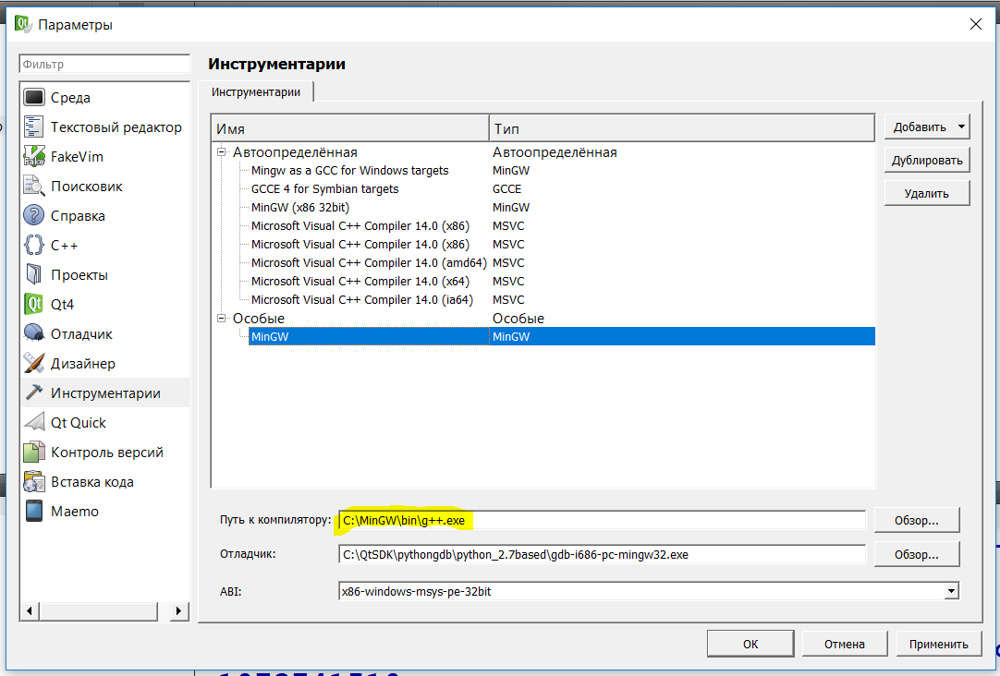
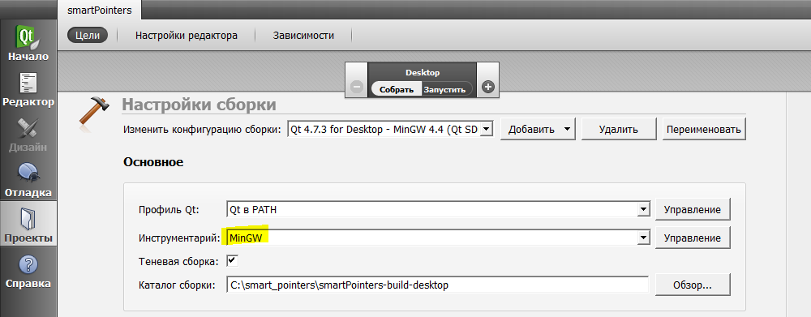

# QT_AGILE_DEVELOPMENT

Если возникнет желание собрать проект, не забудьте прописать в additional include directories папку include

## Добавление компилятора

Инструменты-параметры-инструментарий: 

Желтым выделен путь до [желаемого компилятора](https://sourceforge.net/projects/mingw-w64/files/Toolchains%20targetting%20Win32/Personal%20Builds/mingw-builds/6.3.0/)

Вкладка проекты слева:

Желтым выделено имя, под которым компилер зарегистрирован в метаметаметакомпилере QT (см. пред.)

